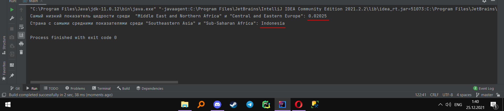
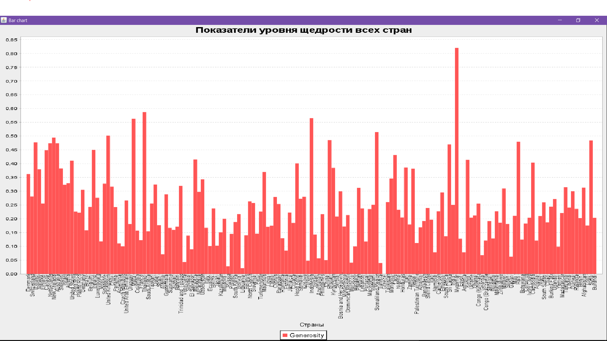

**Последовательность работы по проекту**
1. Добавил в ресурсы scv файл и распарсил его
2. Добавил библиотеку JFreeChats и создал гистограмму по данным из csv файла
3. Создал БД Sqlite и заполнил ее даннымим из csv файла
4. Создал метод для получения самого низкого показателя щедрости среди "Middle East and Northern Africa" и "Central and Eastern Europe"
5. Создал метод для получения страны  с "самыми средними показателями" среди "Southeastern Asia" и "Sub-Saharan Africa"

**Пример вывода показателей**

Самый низкий показатель щедрости среди  "Middle East and Northern Africa" и "Central and Eastern Europe": 0.02025

Страна с самыми средними показателями среди "Southeastern Asia" и "Sub-Saharan Africa": Indonesia

**Пример графика по показателю щедрости по странам**
